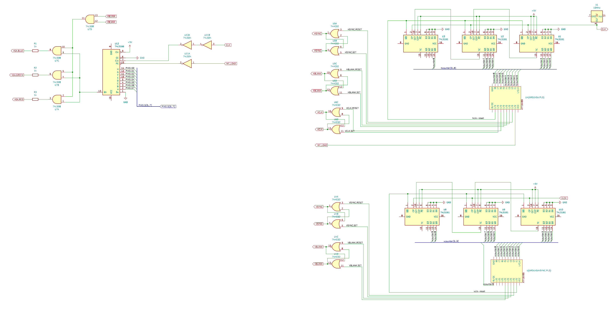

# vga-experiments

GOAL: Create a dual port video RAM memory using a static RAM chip and a few 74HTC245 octal bus transceivers.
(WTF is a dual port RAM? -> [https://en.wikipedia.org/wiki/Dual-ported_RAM](https://en.wikipedia.org/wiki/Dual-ported_RAM))

Current status: Working PoC with Arduino able to write (but not read) to the video memory and contents of video RAM displayed
on a screen. Current resolution is 800x600 but using 4x1 pixels (due to using 10MHz pixel clock, instead of 40MHz required for
800x600 resolution). This gives us graphic with 200x150 4x4 pixels. Currently only single color is supported.

## Prerequisites

### Programming ATF16V8B Chips (PLD or GAL)

Follow this tutorial:

1. [https://mike42.me/blog/2021-08-a-first-look-at-programmable-logic](https://mike42.me/blog/2021-08-a-first-look-at-programmable-logic)
2. If you don't like WinCUPL you may try the open source alternative that the author recommends in a
 follow up [https://mike42.me/blog/2021-10-programming-plds-with-open-source-software](https://mike42.me/blog/2021-10-programming-plds-with-open-source-software).

I was using WinCUPL under Linux via Wine and the program was starting and compiling just fine.
The UI is really outdated and cumbersome to use. But you don't have to stick with it, you may 
call the compiler yourself:
```
cupl.exe -m1lxfjnabe -u C:\WinCUPL\Shared\Atmel.DL C:\MY_PROJECT\MY_FILENAME.pld
```
This command line comes from docs for this VSCode extension (https://marketplace.visualstudio.com/items?itemName=tlgkccampbell.code-cupl). I did not test the extension so I cannot recommend it.

Remember that the output JED file will have the same name as the one used in `Name` declaration in PLD file (avoid spaces BTW):
```
Name            PALSamp1;
Partno          EE459;
Revision        01;
Date            2/3/04;
Designer        A. Weber;
Company         USC EE-Systems;
Location        None;
Assembly        None;
Device          g22v10;
```
(from: https://ece-classes.usc.edu/ee459/library/samples/PLD/PALSamp1.pld).

The PLD language reference:
[https://ece-classes.usc.edu/ee459/library/documents/CUPL_Reference.pdf](https://ece-classes.usc.edu/ee459/library/documents/CUPL_Reference.pdf)

There are also a few examples if you scroll down to PLDs section: [https://ece-classes.usc.edu/ee459/library/](https://ece-classes.usc.edu/ee459/library/)

Web Archive copy: [https://web.archive.org/web/20240707073231/https://ece-classes.usc.edu/ee459/library/](https://web.archive.org/web/20240707073231/https://ece-classes.usc.edu/ee459/library/)


So that was for the software, but we also need a programmer. I was using the popular MiniPRO TL866 II Plus together with `minipro` software (see: [https://gitlab.com/DavidGriffith/minipro](https://gitlab.com/DavidGriffith/minipro)).

If your programmer is quite old you may need to upgrade the firmware first.
Instructions to upgrade firmware: [https://github.com/blurpy/minipro?tab=readme-ov-file#update-firmware](https://github.com/blurpy/minipro?tab=readme-ov-file#update-firmware).
Don't bother updating above `xgproV1181_setup.rar`, the `unar` (yes, unAr) command won't be able to unpack it.
The 1181 version allowed me to program ATF16V8B without any problems.

TIP: A USB cable that you use with MiniPRO TL866 II Plus must be able to withstand high current spikes. Use a short, thick cable.
_If you encounter errors when programming ATF's try a few different cables before looking for another solution._

You can find my PLD/JED files in [PLD](./pld/) directory.

I really wanted to use `.R/.S` extension (that is RS switch on the output of the device) but looks like ATF16V8B does not
support it in "Simple" mode. I was forced to use "Simple" mode as I needed both CLK & OE pins configured as regular inputs.
I plan to switch to a more powerful ATF22V10 chip in the final build.

BTW You can select mode by specifying a suffix to the device in PLD file, e.g. `G16V8AS` means a simple mode while `G16V8MS` means a registered mode. You can find more about those in ATF16V8B _datasheet_ (the truth is out there).

### VGA Signal

This video [https://youtu.be/5exFKr-JJtg?feature=shared](https://youtu.be/5exFKr-JJtg?feature=shared) is all that you need.

If you need a slower introduction you may want to check Ben Eater's videos [https://eater.net/vga](https://eater.net/vga).

VGA Timings [http://tinyvga.com/vga-timing](http://tinyvga.com/vga-timing), if it's gone there is a web-archive [copy](https://web.archive.org/web/20240811040718/http://tinyvga.com/vga-timing).

Alternative designs: [https://www.youtube.com/watch?v=RcMilPYFlr0](https://www.youtube.com/watch?v=RcMilPYFlr0). The guy is building a PC compatible computer using breadboards. But uses a dedicated chips for it's VGA card. It is a more complicated design but
supports multiple colors and is PC compatible.


## Schematics

[schematics](./schematics/) directory contains both PNG & PDFs.

VGA Timing signals generator and shifting register:



